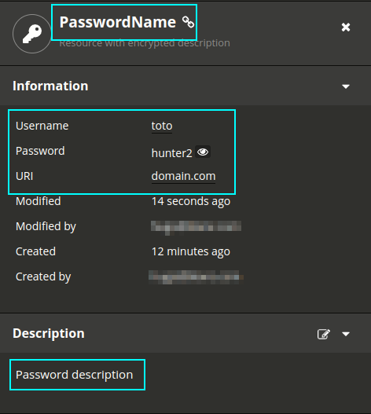

# pass2passbolt

A command-line utility to send [pass](https://www.passwordstore.org/) passwords to [passbolt](https://www.passbolt.com/)

<!-- TOC depthFrom:1 depthTo:6 withLinks:1 updateOnSave:1 orderedList:0 -->

- [pass2passbolt](#pass2passbolt)
	- [Usage](#usage)
	- [Installation](#installation)
	- [License](#license)

<!-- /TOC -->

## Usage

The typical usage is the following:

```
pass show path/to/password | pass2passbolt --uri domain.com --address https://passbolt.local --main-password PassBoltPassword --private-key ~/Documents/passbolt-priv-key.txt --name PasswordName --desc "Password description"
```

Where:
* `--uri` is the domain on which the password will be used (twitter.com, google.com...)
* `--address` is the Passbolt server address
* `--main-password` is the account main passwords
* `--private-key` is the path to the private key provided at registration
* `--name` is the password name is Passbolt
* `--desc` is the password description in Passbolt

If we admit that the `pass` user is "toto" and the `pass` password is "hunter2", this command creates the following entry:



## Installation

You can either:

* grab the latest release [here](https://github.com/eze-kiel/pass2passbolt/releases);
* build your own version of `pass2passbolt`:

```
git clone https://github.com/eze-kiel/pass2passbolt.git
cd pass2passbolt/
make build
```

## License

MIT
